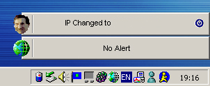



## Personal Frankwall \*UPDATED\*

### Description

This is a Norton Personal Firewall Alertbar style aplette. It doesnt do much except pops out from the side of the screen when your IP address changes just to let you know what it has been changed to. Its a good example of skin mapping a form (taken from various other code submitted on PSC, so thanks). You can customize the skin on the form by right clicking on initially Franks face and changing it from the customize menu. I have put some extra skins in for you such as Moon and Mike Page, I hope you like it, I think its very funny, you can put your mates faces on it, anyways, please get it, comment and vote it.

Thanks allot, Nick Pateman :)

I fixed a few silly bugs, and now I think this is an essential item to anyones desktop, especially if you want to know what your ip address is very quickly, anyways CHECK IT OUT!!!, you'll love it!!!! You could even put your dogs face on it!, if you like that kind of thing?
 
### More Info
 

             |
---                |---
**Submitted On**   |2001-05-05 22:44:26
**By**             |[Niknak\!\!](https://github.com/Planet-Source-Code/PSCIndex/blob/master/ByAuthor/niknak.md)
**Level**          |Advanced
**User Rating**    |5.0 (10 globes from 2 users)
**Compatibility**  |VB 6\.0
**Category**       |[Jokes/ Humor](https://github.com/Planet-Source-Code/PSCIndex/blob/master/ByCategory/jokes-humor__1-40.md)
**World**          |[Visual Basic](https://github.com/Planet-Source-Code/PSCIndex/blob/master/ByWorld/visual-basic.md)
**Archive File**   |[Personal F19256552001\.zip](https://github.com/Planet-Source-Code/niknak-personal-frankwall-updated__1-22974/archive/master.zip)

